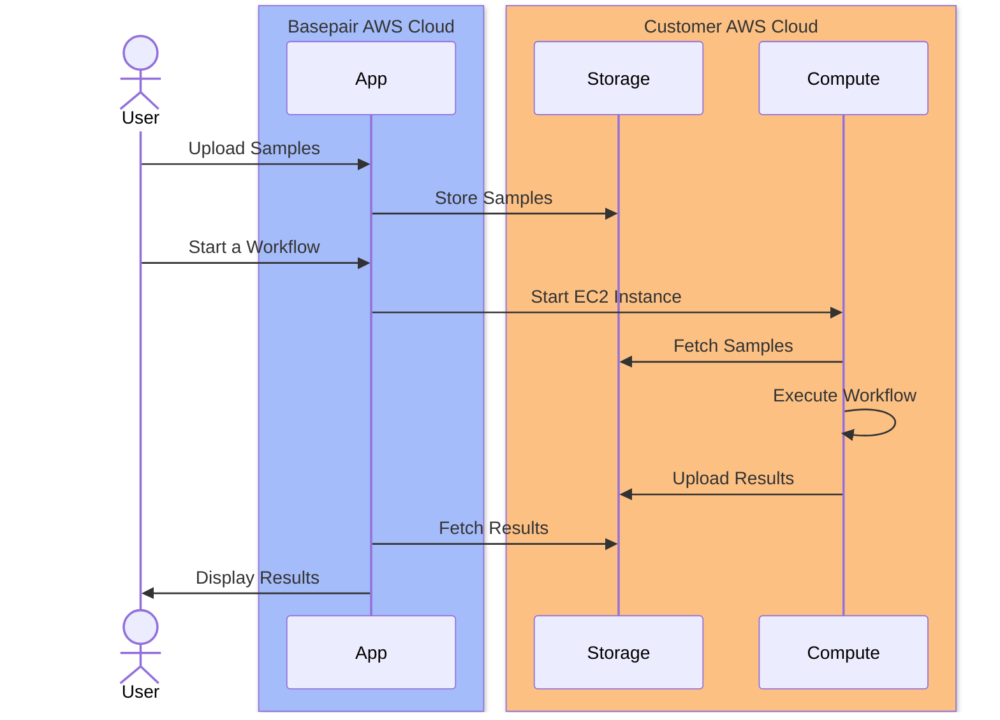

# Connected Cloud for Basepair

This project contains the AWS CDK code to set up Connected Cloud for Basepair.

## What is connected cloud?

* Connected Cloud is a solution that allows you to run NSG workflows on Basepair platform with your own AWS account.
* Customer will interact with Basepair platform to upload samples and start workflows. 
* Basepair platform will then connect with customer's AWS account to fetch samples, run workflows and upload results.
* Customer will be able to view results on Basepair platform.

### Sequence Diagram



## Pre-requisites
1. Download and install [AWS CLI](https://docs.aws.amazon.com/cli/latest/userguide/install-cliv2.html)
2. Download and install [CDK CLI](https://docs.aws.amazon.com/cdk/latest/guide/getting_started.html#getting_started_install)
3. Configure AWS CLI with your AWS account credentials
4. Bootstrap your AWS account with CDK CLI 
   1. `cdk bootstrap aws://<ACCOUNT-NUMBER>/<REGION>`
   2. Make sure you have permissions to create IAM roles and policies in your AWS account 
5. Create python virtual environment and activate it
   1. `python3 -m venv venv`
   2. `source venv/bin/activate`
6. Install dependencies
   1. `pip install -r requirements.txt`

## Deployment

1. If you want to use `Connected cloud with Health Omics`, please click on the `Launch Stack` button above and follow the instructions

<a href="https://console.aws.amazon.com/cloudformation/home?region=region#/stacks/new?stackName=BasepairConnectedCloud&templateURL=https://bp-publc.s3.amazonaws.com/cfn-mp-ql-basepair-ngs-ho-payg.yml"></a>

2. If you want to use `Connected cloud without Health Omics`, please click on the `Launch Basepair Stack` button above and follow the instructions

<a href="https://console.aws.amazon.com/cloudformation/home?region=region#/stacks/new?stackName=BasepairConnectedCloud&templateURL=https://bp-publc.s3.amazonaws.com/cfn-mp-ql-basepair-ngs-payg.yml"></a>

## Development

1. Request `BasepairAccountId` and `BasepairRoleName` from Basepair Team
2. Run the below command and wait for the deployment to complete
   ```
   cdk deploy \
       --parameters BasepairAccountId=<Basepair Account Id> \
       --parameters BasepairRoleName=<Basepair Role Name> \
       --require-approval never \ 
       --outputs-file cdk.out.json
   ```
3. After the above command is successfully completed, Please share the `cdk.out.json` file with Basepair Team
4. For any support, please reach out to Basepair Team


